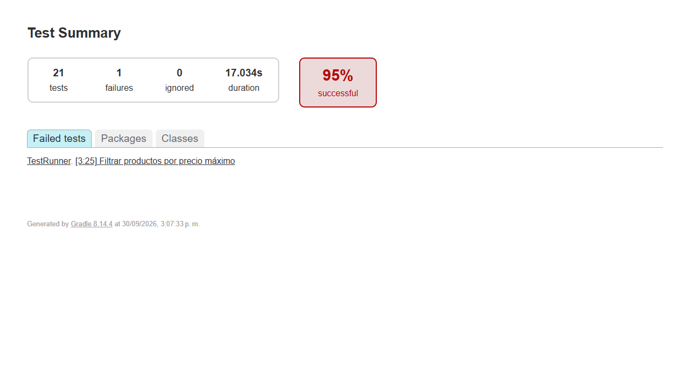
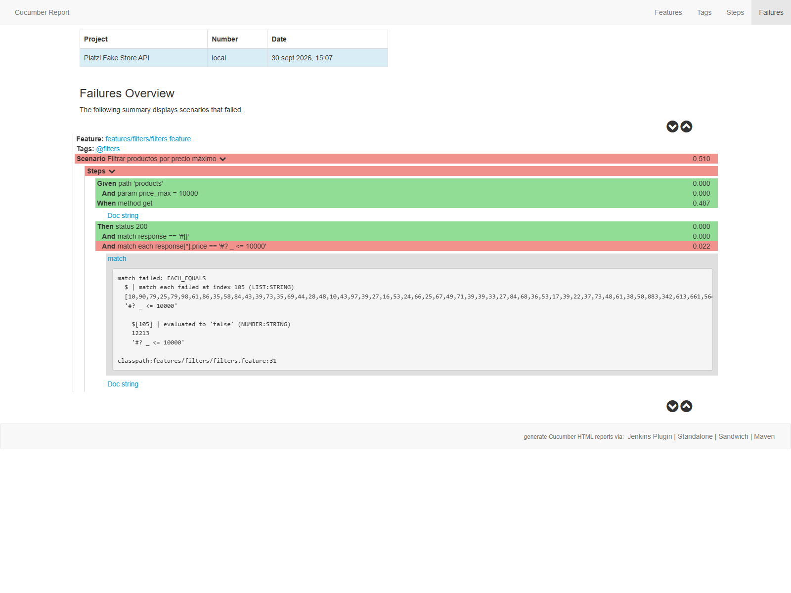

# Respuestas

**a. ¿Cuáles fueron los principales desafíos?**

La API es pública y sus datos pueden cambiar. Un producto con ID `1` ya no estaba disponible, así que hice que la prueba obtuviera un producto existente antes de consultar su detalle. También encontré que la API no aplica el filtro `price_max` como se esperaba.

**b. ¿Qué técnicas de prueba y enfoque se usaron?**

Usé pruebas funcionales positivas y negativas, consultas de filtros y escenarios CRUD. Organicé los casos con Gherkin por productos, filtros, categorías y usuarios, y dejé los datos y esquemas en archivos reutilizables.

**c. ¿Cómo se validaron los datos y la estructura JSON?**

Cada escenario comprueba el estado HTTP y valida los campos y tipos de la respuesta con esquemas Karate. También se revisan headers y valores importantes, como el título, precio o identificador.

**d. ¿Qué aprendí?**

Aprendí a convertir el comportamiento esperado de una API en escenarios automáticos y a distinguir un error de la prueba de una discrepancia del servicio. El caso de `price_max` muestra que un resultado fallido también puede aportar evidencia útil para QA.

## Resultado de Cucumber

En la ejecución del 30 de septiembre de 2026, Cucumber reportó **21 escenarios: 20 aprobados y 1 fallido (95 %)**. Falló “Filtrar productos por precio máximo”: con `price_max=10000`, la API respondió `200`, pero incluyó un producto con precio `12213`. Las demás comprobaciones de ese escenario pasaron.

**Resumen de ejecución:**

**Detalle del escenario fallido en Cucumber:**

